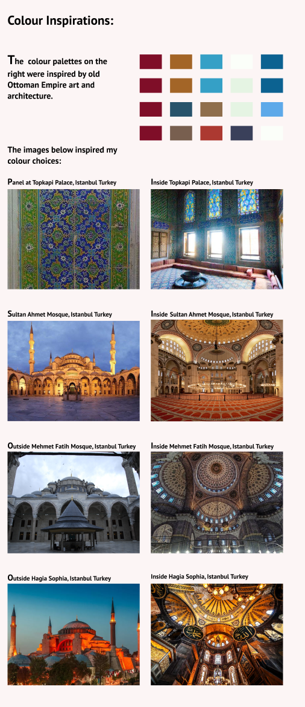

# Major Rails Project

## App:

## Outline
<!-- Description of what your project is going to be -->
<!-- it is not a detailed description of the app -->
A platform that connects personal trainers, fitness & strength coaches and mentors to gyms and other training facilities. One problems these people have is needing to outlay so much money to work and gain experience in the industry. They either have to hire/rent a gym for their sessions or establish a new gym, which is very costly. 

## Problem
To hire a gym for training clients, it can cost more than $50 per session and some gyms even charge a yearly fee for trainers to use their facilities. This is expecially troubling for those new to the industry and want to gain experience but can't afford it. 

## Solution
The app allows trainers to find gyms that allow for casual fee payments to use their facilities, rather than being locked into a contract and stuck at 1 gym only. This will benefit both trainers and gyms, as it will provide trainers the opportunity of more work, and for gyms they will have more trainers using their facility, therefore more money from hire fees. This also allows trainers to move around and use different gyms, and work with different clients, and increase their experience. The way it works is the trainer will enter a area/location and then all gyms (supporting gyms only) within that area will show up. The trainers will have to select an available time-slot for whichever gym they choose, and then pay for their booking online. The trainer will then be able to ask his clients to meet at the gym and train them. The gyms and trainers wil each have a profile that can be viewed on the app.

## **Design/ set-out Insipiaration**
    
I spent a lot of time looking at other website designs to develop some ideas for my site.  

I found one site that I really liked and decided to stick with it. Have a look at the images below:

MOBILE VIEW:

<!--  -->
<!-- PUT MOBILE IMAGE HERE -->

DESKTOP VIEW:

<!--  -->
<!-- PUT DESKTOP IMAGE HERE -->

## **Colors**

I got my color inspiration from old art and architecture. I travelled to Turkey last year and I really liked the Ottoman art and architecture. I found the colors beautiful and made me feel at ease. They used colors that made you feel calm and warm. I wanted my personal website to have the same impact on the viewer, and so I dervied my color palettes from some of the Ottoman buildings. I was able to do this using a color palette tool extension on google chrome. Below are the images of the buildings I chose to derive my colour palettes from. 

OTTOMAN BUILDINGS:

<!--  -->
<!-- PUT COLORS IMAGE HERE -->

The image below is the color scheme for my website:

<!-- PUT COLOR SCHEME IMAGE HERE -->

<!--  -->

# **Fonts**

I chose 3 fonts of each of serif, san serif and classic. 

<!--  -->
<!-- PUT FONTS IMAGE HERE -->

<!-- # **Drafts**

Here are the drafts of my work, I played around with it until I got to my final design. 

Below is an image of my whole design process:

 -->

