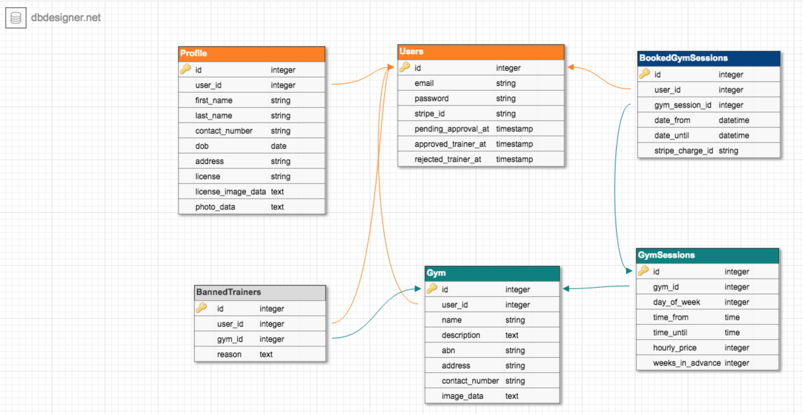

# Major Rails Project

## App:

## Outline
<!-- Description of what your project is going to be -->
<!-- it is not a detailed description of the app -->
Essentially the app is a platform that connects personal trainers, fitness &strength coaches and mentors to gyms and other training facilities. It's aim is to enhance the fitness industry and increase  job opportunities. 

## Problem
One problems these people have is needing to outlay so much money to work and gain experience in the industry. They either have to hire/rent a gym/facility to run their sessions and train clients or establish a new gym, which is very costly.

To hire a gym for training clients, it can cost more than $50 per session and some gyms even charge a yearly fee for trainers to use their facilities. This is expecially troubling for those new to the industry and want to gain experience but can't afford it. 

## Solution
The app allows trainers to find gyms that allow for casual fee payments to use their facilities, rather than being locked into a contract and stuck at 1 gym only. This will benefit both trainers and gyms, as it will provide trainers the opportunity of more work, and for gyms they will have more trainers using their facility, therefore more money from hire fees. This also allows trainers to move around and use different gyms, and work with different clients, and increase their experience. The way it works is the trainer will enter a area/location and then all gyms (supporting gyms only) within that area will show up. The trainers will have to select an available time-slot for whichever gym they choose, and then pay for their booking online. The trainer will then be able to ask his clients to meet at the gym and train them. The gyms and trainers wil each have a profile that can be viewed on the app. All payments and booking are made through the app.

## **Design/ set-out Insipiaration**
    
I spent a lot of time looking at other website designs to develop some ideas for my site.  

I stumbled across the Uber website and liked its setout and design, I decided to use it to inspire my design. Have a look at the images below:

MOBILE VIEW:

 

DESKTOP VIEW:

<!-- PUT DESKTOP IMAGE HERE -->

## **Colors**

I got my color inspiration from modern design and architecture. I was a part of the building of a local community centre which has won many awards for its great design and architecture. This centre is known as 'The Australian Islamic Centre', located in Melbourne's West. This has a personal feel because I visit this centre for prayers, on a daily basis and it is the home of our community. 

I dervied my color palettes from some parts of the building. I was able to do this using a color palette tool extension on google chrome. Below are the images of the buildings I chose to derive my colour palettes from. The images are shot from different sections of the centre. 

AUSTRALIAN ISLAMIC CENTRE:

The image below is the color scheme for my website:

## **Fonts**

I chose 3 fonts of each of serif, san serif and classic. 

## **User Stories**

I used Trello for my user stories. This helped me brainstorm how I want the user experience to be when operating my app. By writing I was able to generate a mental map of the paths I want certain users to take when navigating the app. When writing the user stories, I came up with new ideas for features I could add to the site. 

Below is a snippet of the user personas and user stories made in trello:

For the full trello, head over to 
[https://trello.com/b/3UTZ2m0L/major-rails-project](https://trello.com/b/3UTZ2m0L/major-rails-project)

## **Workflow Diagram**

After completing my user stories and user personas, I moved onto designing a workflow diagram for both user types. This helped me visualise the paths each user was going to take to perform certain tasks. To create my workflow diagram, I used 'draw.io' which is an online diagram software for making flowcharts and diagrams. 

Below is the diagram I designed for my app:

## **Entity Relationship Diagram (ERD)**

I used an online database designer tool called 'DB Designer'. This tool is free to use and has all the functions needed to build an effect ERD for the app. This helped me plan and setout the relationships of all my models and users. 

Below is the ERD I designed for my app:

## **Tools I used**

[TRELLO](https://trello.com)

Trello was a very useful tool because it has all the functionality needed to plan and breakdown the work into small achievable stages. I was able to set myself some goals on a 'To Do' list and slowly check off each item, this gave me a record of how I was progressing.

[DRAW.IO](https://www.draw.io/)

This is a great tool, as it is free and has all the functionality needed to draw up and map out digrams. One of the good features of this tool is that it saves the file straight onto my Google Driv, this allows me to access it from anywhere I want.

[DB DESIGNER](https://www.dbdesigner.net/)

This tool was very helpful during the planning, as it allowed me to visualise all the models of my app and how they relate to each other and most importantly, how they relate to the users. I found this tool especially useful when I was developing my app, because I kept referring to it to better understand the relationships of all my models.  

[FIGMA](https://www.figma.com/)

This tool was very helpful for the design layout and planning of the app. I used this to plan and design all my app pages layouts. It is powerful and easy to use. My favourite  feature of this tool is that it has a mobile app which allows you to view your design for mobile view, on your mobile device, and this is helpful because you can get a more accurate display of how the app layout will in your hand. 

## **Final Design Mobile**

Below is my final design plan for the mobile view of my app:

## **Problems**

Throughout the process of developing this app I encountered many problems which needed to be addressed. I mainly had problems in the development phase of the app. 

## **Future Development and Project Improvements**

## **Lessons Learnt**

## **Overall Experience**

